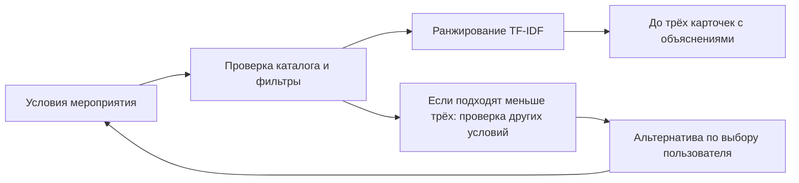

# Firebird — умный подбор event-подрядчиков

Помогаем выбрать подрядчика для мероприятия и найти проверенный запасной вариант,
если на нужную дату или бюджет подходящих людей мало.

## [🚀 Открыть сайт и попробовать подбор](https://firebird-six.vercel.app/)

**Без установки и регистрации.** [Документация API](https://firebird-six.vercel.app/docs).

Для быстрой проверки: **Алматы → Ведущий → корпоратив → 15.10.2026 → 1 200 000 ₸**.
Получите 3 карточки из 6 подходящих. Измените дату на **19.12.2026**: останется 1;
во вкладке «Запасные варианты» примените **17.12.2026** — появятся 3.
Публичное демо использует Supabase и локальные объяснения с проверенными цитатами; платная AI-модель не вызывается.

API и CLI для Firebird / HackAlem AI (#79-lite). Из городского каталога сервис выбирает до трёх подходящих подрядчиков и объясняет выбор проверяемыми фактами. Исходный CSV содержит 66 профилей, в том числе 13 синтетических; собственных профилей в рабочие данные не добавлено.

**Навигация:** [Возможности](#что-умеет-сервис) · [Технологии](#технологии) ·
[Быстрый запуск](#быстрый-запуск) · [API](#запрос-и-три-исхода) ·
[Проверки](#проверка) · [Ограничения](#ограничения-данных).

## Что умеет сервис

- Принимает город, дату, формат, категорию и бюджет; учитывает язык, длительность и пожелания.
- Проверяет занятость и обязательные условия, затем показывает до трёх карточек.
- Объясняет выбор фактами и дословными фрагментами описаний; отмечает, что нужно уточнить.
- При недостаточном выборе предлагает проверенное изменение даты, бюджета или длительности.
- Различает отсутствие категории в городе и отсутствие кандидатов, подходящих под условия.

## Технологии

| Часть | Что используется |
|---|---|
| Backend | Python, FastAPI, Pydantic; общий алгоритм для REST API и CLI |
| Frontend | HTML, CSS, JavaScript; адаптивная страница «рядом.» |
| Подбор | Фильтры по фактам каталога, символьный TF-IDF, детерминированный порядок |
| Данные | 66 исходных профилей; Supabase / PostgreSQL в облаке, CSV для локального запуска |
| Публикация | Vercel Hobby + Supabase Free |
| Проверки | Python unittest, Node.js test runner, OpenAPI и TypeScript-контракт |
| AI-адаптеры | Подготовлены OpenAI, NVIDIA Build и Brev/NIM; публичное демо использует локальные объяснения |

### Схема работы



## Веб-страница

Готовый интерфейс находится в [web/](web/README.md). Он сохраняет серверный порядок карточек и использует `integration/api-client.mjs`: вертикальная форма с пожеланиями, основная подборка, вкладка с проверенными запасными вариантами и пояснениями по пожеланиям. Запускайте страницу и API локально по инструкции в `web/README.md`; GitHub Actions для проверки не требуется.

## Для команды фронтенда и Codex

Начните с [AGENTS.md](AGENTS.md) и [инструкции подключения интерфейса](docs/FRONTEND_HANDOFF.md). В [integration/](integration/README.md) готовы HTTP-клиент без привязки к фреймворку, TypeScript-типы, OpenAPI и реальные примеры ответов для вёрстки. Справочник формы, подбор и альтернативы предоставляет Python API; дизайн и компоненты разрабатывает команда.

Локально разрешены браузерные запросы с localhost и 127.0.0.1 на портах 3000, 4317, 5173. Другие адреса задаются через `CORS_ALLOWED_ORIGINS` — точные origins через запятую, без `*`. После изменения перезапустите backend. Инструкция описывает также подключение через `/api` proxy и обработку ошибок, отмены и устаревших ответов.

## Главная фишка: что изменить, чтобы появился выбор

При 0–2 подходящих профилях сервис проверяет другую дату, больший бюджет и меньшую длительность. Возвращает до трёх проверенных вариантов с готовым запросом и числом кандидатов. Исходные карточки остаются ответом на исходные условия.

~~~powershell
.\.venv\Scripts\python.exe -m contractor_match.demo --story
~~~

Реальная история из каталога: ведущий Алматы за 1 200 000 ₸ — **15 октября подходят 6 → 19 декабря 1 → предложенная дата 17 декабря даёт 3**. Флорист Астаны 15 октября за 100 000 ₸ — 0; только сочетание **16 октября + 300 000 ₸** даёт 1. Повышение бюджета само по себе занятость не исправляет.

## Быстрый запуск

Python 3.11 или новее и Git. Сначала скачайте проект:

```sh
git clone https://github.com/BAITC-Hacks/hack-0105a7f9-refrigerators.git
cd hack-0105a7f9-refrigerators
```

Репозиторий приватный: для клонирования нужен доступ команды. Публичное демо выше
открывается без доступа к GitHub. Дальше все команды выполняются из корня проекта.
Они запускают **сайт и API вместе**, с CSV и локальными объяснениями; ключи не нужны.

Windows PowerShell:

~~~powershell
python -m venv .venv
.\.venv\Scripts\python.exe -m pip install -r requirements-lock.txt
$env:AI_PROVIDER = 'local'
$env:RANKING_PROVIDER = 'tfidf'
$env:CATALOGUE_PROVIDER = 'csv'
.\.venv\Scripts\python.exe run_web.py --no-browser
~~~

Linux / macOS:

~~~bash
python3 -m venv .venv
.venv/bin/python -m pip install -r requirements-lock.txt
AI_PROVIDER=local RANKING_PROVIDER=tfidf CATALOGUE_PROVIDER=csv .venv/bin/python run_web.py --no-browser
~~~

`requirements-lock.txt` и `requirements.txt` содержат одинаковые зафиксированные версии проверенного окружения. Плоский список нужен сборщику Vercel. При обновлении зависимостей повторите тесты и проверку экспорта: схема может зависеть от версии FastAPI/Pydantic.

**Откройте [локальный сайт](http://127.0.0.1:8000/).** Терминал оставьте открытым.
Документация запросов: [Swagger UI](http://127.0.0.1:8000/docs).
Если порт занят, добавьте `--port 8001` к команде `run_web.py`.

`GET /health` проверяет готовность без обращения к модели.
`GET /catalogue/options` возвращает города, категории по городам, форматы, языки и окно календаря.

При запуске проверяются CSV и конфигурация, затем строится индекс. С повреждённым каталогом или неизвестным AI_PROVIDER сервер не стартует. Данные и индекс хранятся в памяти: после изменения CSV требуется перезапуск. Общий парсер допускает маленькие тестовые каталоги; рабочий загрузчик дополнительно проверяет исходные 66 профилей и 13 синтетических.

## CLI и демонстрация

Самодиагностика без сетевых вызовов:

~~~powershell
.\.venv\Scripts\python.exe -m contractor_match doctor --frontend-origin http://localhost:5173
.\.venv\Scripts\python.exe -m contractor_match doctor --json
~~~

Doctor проверяет Python, зависимости, настройки, CORS, исходный каталог и локальный индекс. Команда работает и до установки пакетов: сообщает об отсутствующих зависимостях. Наличие ключа не означает проверки доступа к модели. Код выхода 1 — ошибка, 0 — локальные проверки пройдены или есть предупреждения.

У ответов API есть `X-Request-ID` для поиска в логах и `X-Process-Time-Ms` для времени до начала ответа. Клиент предоставляет `ApiClientError.requestId`. В stderr пишутся JSON-события с этапами подбора, причинами fallback и безопасным местом сбоя. [Инструкция по диагностике](docs/DEBUGGING.md) показывает, как сохранить журнал и найти ошибку. CLI `--json` сохраняет чистый результат в stdout.

~~~powershell
.\.venv\Scripts\python.exe -m contractor_match recommend --city Алматы --date 2026-10-15 --event-format корпоратив --category Ведущий --budget-kzt 1200000 --brief 'спокойный ведущий делового форума'
.\.venv\Scripts\python.exe -m contractor_match.demo
.\.venv\Scripts\python.exe -m contractor_match.demo --json
~~~

На Linux / macOS замените путь к Python на `.venv/bin/python`.
Команда recommend с `--json` выводит тот же контракт, что API.

Демо вызывает настоящий pipeline на восьми запросах: ведущий осенью и в декабре, флорист, отсутствующая категория, невыполненные условия, площадка, отрицательное пожелание и фотограф. Первые два запроса отличаются только датой. На 15 октября подходят шесть ведущих Алматы, показываются три; на 19 декабря — один. Демо всегда локальное по умолчанию, даже если в окружении есть ключи.

## Запрос и три исхода

`POST /recommendations`:

~~~json
{
  "city": "Алматы",
  "date": "2026-10-15",
  "event_format": "корпоратив",
  "category": "Ведущий",
  "budget_kzt": 1200000,
  "duration_hours": 6,
  "language": "русский",
  "brief": "спокойный ведущий делового форума"
}
~~~

Первые пять полей обязательны. Форматы и языки перечислены в справочнике.
Город, категория, формат и язык принимаются в любом регистре с нормализацией пробелов.
Дата — календарная строка ГГГГ-ММ-ДД от **2026-09-23 до 2026-12-31 включительно**.
Бюджет — положительное целое JSON-число до 9 007 199 254 740 991 включительно (без потери точности в JavaScript); boolean и числовые строки отклоняются. Тело POST ограничено 64 КиБ; превышение возвращает 413 `request_too_large`.
Длительность — положительное конечное число; null отключает этот входной фильтр.
Город и категория ограничены 100 символами, brief — 500; неизвестные поля запроса запрещены.

| Результат | HTTP | Значение |
|---|---|---|
| matched | 200 | Есть 1–3 подходящие карточки |
| category_absent | 200 | Известной категории нет в выбранном городе |
| no_eligible | 200 | Категория есть, но все кандидаты исключены условиями |
| invalid_request | 422 | Некорректные параметры или неизвестный город/категория справочника |
| request_too_large | 413 | Тело запроса превышает 64 КиБ |
| catalogue_unavailable | 503 | Не удалось загрузить проверенный каталог из Supabase |
| service_misconfigured | 503 | Неверная конфигурация сервиса; при старте она предотвращает запуск |
| internal_error | 500 | Неожиданная ошибка сервера; безопасное сообщение без внутренних деталей |

Например, «Декоратор» в Астане — category_absent; неизвестная категория с опечаткой — 422. Значения не исправляются догадками.

Ошибки API имеют один формат (включая 404 и 405):

~~~json
{
  "error": {
    "code": "invalid_request",
    "message": "Проверьте параметры запроса.",
    "details": [{"field": "budget_kzt", "message": "Укажите целое число."}]
  }
}
~~~

Успешный бизнес-ответ сохраняет поля status, message, cards, reasons и ai_mode.
Добавлены:

- `counts`: category_total, eligible_total, returned_total и excluded_total. Последний — число уникальных исключённых профилей.
- `ai_reason`: безопасная причина выбранного режима объяснений.
- `cards[].evidence_note`: ограничение доказательства, если оно есть; тот же текст виден в объяснении.
- `understanding`: распознанные стили, нежелательные элементы, языки, применённый язык и источник этого решения.
- `cards[].why_fits`, `to_clarify`, `differences`: проверенные основания, вопросы к подрядчику и сравнение с показанными карточками.
- `alternatives`: changes (field/from_value/to_value), полный request, eligible_count, added_count, candidate_ids, message. ID перечислены для проверки условий, не ранжированы как новая выдача. Повторный POST с request применяет вариант.
- `alternatives_note`: границы поиска и правило выбора компромисса.
- `ranking_mode`, `ranking_reason`: фактический способ ранжирования и причина fallback, отдельно от режима объяснений.

Причины busy, over_budget, wrong_format, wrong_language и too_short могут пересекаться. Сумма reasons не равна числу исключённых. Сообщение показывает число занятых на запрошенную дату, даже если удалось вернуть три карточки. Если подходят больше трёх, message отдельно сообщает об ограничении выдачи.

## Как работает подбор

1. Проверка входа и локальный разбор пожелания, загрузка проверенного каталога.
2. Локальные фильтры: город, членство в категории, дата, формат, стартовая цена, язык и длительность. Описание и AI не могут отменить фильтр. У площадок действует тот же календарь.
3. Детерминированное символьное TF-IDF сходство описания с запросом, затем меньшая стартовая цена и стабильный id. Версия базового ранжирования: char-tfidf-3-5-v1. Режим объяснений не меняет порядок. По явному RANKING_PROVIDER=brev доступен экспериментальный NIM reranker после фильтров; при сбое используется TF-IDF.
4. Для выбранных профилей выделяются точные фрагменты описания. Локальные текстовые подсказки помогают искать стиль, опыт и подход; общая реклама получает меньший приоритет. До трёх фрагментов каждого профиля образуют список, из которого выбирает AI либо локальный алгоритм.
5. Общая проверка для обоих режимов подтверждает набор id, длину цитаты, точное вхождение в исходное описание и принадлежность списку. Невалидный AI-ответ заменяется проверенным локальным.
6. Объяснение собирается из структурированных фактов и цитаты. Повторяющиеся цитаты по возможности заменяются другими допустимыми; если это невозможно, отсутствие подтверждённого отличия обозначается явно.

TF-IDF и словарь подсказок не доказывают смысловое выполнение всего brief. Пожелание с отрицанием, например «без шумных конкурсов», всегда сопровождается уточнением: его нужно подтвердить у подрядчика. Это не новый жёсткий фильтр. Строки brief и description передаются модели только как данные, без ключей и переписки.

## Пожелания и альтернативы

«Нужен спокойный ведущий, без конкурсов, на русском» распознаётся локальными правилами: стиль — спокойный; нежелательно — без конкурсов; язык — русский. Если language не указан, однозначная фраза «на русском/казахском/английском» становится языковым фильтром и явно отражается в understanding. Отдельное поле language имеет приоритет; противоречие с текстом отмечается. При нескольких языках требуется уточнение — система не выбирает один сама.

Это ограниченный словарь, не полноценное понимание произвольного текста: стили спокойный/креативный/традиционный, распространённые отрицания и три языка. Неподтверждённые пожелания попадают в to_clarify; цитата не означает гарантии выполнения. Разница стартовых цен сравнивается только среди показанных. Собственная цитата не доказывает, что у остальных нет такого же опыта.

Альтернативы используют тот же фильтр, что основные карточки; город, категория, формат и язык не меняются. По каждому отдельному полю предлагается наименьшее изменение, увеличивающее **общее число** подходящих: ближайшая дата в окне (при равной дистанции — более поздняя), минимальный бюджет до следующего подходящего ценового порога, наименьшее сокращение часов. max_hours=null не создаёт ограничения.

Если ни одно поле отдельно не помогает, перебираются сочетания двух, затем трёх полей. Исключаются варианты, у которых все изменения не меньше, чем у другого проверенного варианта; остаётся до трёх с приоритетом расстояния по дате, повышения бюджета, сокращения часов. Это явно описанный компромисс, а не универсальная оценка удобства заказчика. При 3+ подходящих альтернативы не нужны. Пустой список не обещает невозможность решения вообще: проверен только этот набор изменений в исходном каталоге. Цена по-прежнему «от»; доступность — по датасету.

## AI и локальный режим

Конфигурация централизована в contractor_match/config.py. Приложение читает **переменные окружения**; файл .env.example — образец, .env автоматически не загружается.

- local — локальные объяснения; вместе с RANKING_PROVIDER=tfidf весь подбор работает без сети.
- openai / nvidia — явный провайдер.
- brev — явно настроенный NIM chat-сервис; auto его не выбирает. [Подключение Brev/NIM](docs/BREV.md).
- auto (по умолчанию) — OpenAI при непустом ключе, иначе NVIDIA, иначе локальный режим. Эта последовательность применяется до вызова; переключений и повторов после ошибки нет.

~~~powershell
$env:AI_PROVIDER = 'openai'
$env:OPENAI_API_KEY = '<локально сохранённый API-ключ>'
# либо
$env:AI_PROVIDER = 'nvidia'
$env:NVIDIA_API_KEY = '<ключ NVIDIA Build nvapi-…>'
~~~

На Linux / macOS: `export AI_PROVIDER=openai` и соответствующая переменная ключа. Ключи не добавляйте в проект.

Сохранены адаптеры OpenAI gpt-4o-mini через [Responses со структурированным выводом](https://developers.openai.com/api/docs/guides/structured-outputs) и [NVIDIA mistralai/mistral-nemotron](https://build.nvidia.com/mistralai/mistral-nemotron) через Chat Completions. Модели переопределяются OPENAI_MODEL и NVIDIA_MODEL. Вызовы требуют доступа конкретного аккаунта; [тариф OpenAI зависит от модели](https://developers.openai.com/api/docs/models/gpt-4o-mini). Живой доступ команды к обоим провайдерам пока **не проверен**. Brev-ключ и купон не заменяют inference-ключ: см. [документацию Brev](https://docs.nvidia.com/brev/guides/api-keys).

На внешнюю часть установлен общий срок 6 секунд: опциональный reranker — максимум 2 секунды, объяснения — оставшееся время. Синхронный endpoint FastAPI работает в worker-потоке; при прямом вызове из async-кода используйте `await asyncio.to_thread(recommend, request)`.

| ai_mode | ai_reason |
|---|---|
| openai / nvidia / brev | success — проверенный ответ провайдера |
| not_used | not_needed — карточек нет, модель не вызывалась |
| fallback | local_requested — выбран local; missing_key — нет ключа |
| fallback | timeout, auth_error, rate_limited, network_error, provider_error |
| fallback | invalid_response — повреждённый формат; invalid_evidence — неверные id/цитаты |

Логи отказов содержат провайдера, код причины и request_id. Отдельная запись подбора показывает времена этапов и счётчики. Ключи, brief, сырые ответы сервера и текст исключений в журналы приложения не попадают.

Отдельный живой прогон при настроенном ключе:

~~~powershell
.\.venv\Scripts\python.exe -m contractor_match.demo --provider openai
# либо --provider nvidia
~~~

Этот явный флаг разрешает сетевые вызовы из демо, которые могут расходовать API-баланс. Команда завершается с кодом 1 при fallback в живом режиме или ответе дольше 10 секунд; отсутствие ключа даёт ошибку до первого запроса.

## Проверка по критериям задачи

Локальное демо `python -m contractor_match.demo` выполняет эти сценарии через настоящий pipeline:

| Сценарий | Запрос | Что проверить |
|---|---|---|
| Плотная категория | Ведущий, Алматы, 15.10.2026, 1 200 000 ₸ | Три карточки с разными подтверждающими цитатами; повтор сохраняет порядок. |
| Смена даты | Тот же запрос на 19.12.2026 | Остаётся один подходящий; сообщение показывает число занятых. |
| Редкая категория | Флорист, Алматы, 15.10.2026, 300 000 ₸ | Один кандидат и причина короткой выдачи. |
| Нет подходящих | Флорист, Астана, 15.10.2026, 100 000 ₸ | no_eligible, пустые карточки и причины словами. |
| Нет категории | Декоратор, Астана | Отдельный исход category_absent. |

Для оценки объяснений скройте имена: цитаты должны помогать отличать кандидатов. Если исходные описания не дают подтверждённых различий, сервис отмечает это ограничение. Ориентир ответа — до 10 секунд; демо измеряет время каждого реального вызова. Сетевое время живого AI проверяется отдельно.

## Проверка

~~~powershell
.\.venv\Scripts\python.exe -m unittest discover -s tests -v
.\.venv\Scripts\python.exe -m contractor_match.export_contract --check
node --test integration/tests/api-client.test.mjs
~~~

Для тестов клиента нужен Node.js 22+. Тесты работают без интернета и настоящих ключей. Проверяются фильтры и их границы, 0/1/2/3 карточки, все три исхода, повреждённый CSV, повторные id, тайм-аут и ошибки AI, локальные цитаты, неизменность порядка при перезапуске, смене регистра и режима объяснений. Проверки интеграции охватывают CORS, безопасные ошибки, контракт, преобразование формы, отмену и запоздавшие ответы.

После изменения схемы обновите файлы для фронтенда командой `python -m contractor_match.export_contract` и включите их в тот же коммит. Режим `--check` обнаруживает расхождение без записи. Экспорт принудительно использует local + tfidf, даже при наличии ключей.

GitHub Actions отключён: тесты и локальное демо запускаются в рабочей среде без расходов на GitHub. На 23.09.2026 локально прошли **70 Python-тестов и 19 тестов JavaScript-клиента**, включая матрицу из 264 сценариев на исходном каталоге. [Отчёт о проверке](docs/DEBUG_REPORT.md), [состояние проекта](docs/PROJECT_STATE.md).

## Объединённые работы команды

В `main` сохранена история обеих веток `codex/*`. Рабочий сайт — `web/`, мобильные концепты — [future-app-figma/](future-app-figma/README.md), ранний автономный вариант — [prototypes/offline-web/](prototypes/offline-web/README.md). Архивный подборщик не используется публичным сайтом. [Обзор работ](docs/REPOSITORY_REVIEW.md).

[Соответствие исходному ТЗ](docs/REQUIREMENTS.md), [измерения и оценка объяснений](docs/EVALUATION.md), [состояние проекта](docs/PROJECT_STATE.md).

## Ограничения данных

Цена указана **«от» за мероприятие**, это не почасовой тариф и не окончательная смета.
max_hours = null означает, что ограничение присутствия на площадке неприменимо.
Отсутствие даты в busy_dates подтверждает доступность только в окне датасета.
synthetic, city_imputed и price_imputed сохраняются в карточках; восстановленные значения не подтверждены подрядчиком.
Бронирование, заявки и живое обновление календаря не реализованы.

Источник — приложенные материалы HackAlem AI: DOCX определяет ТЗ, CSV — факты, HTML служит превью. Диагностика, строгая схема входа и дополнительные проверки — инженерные улучшения команды, а не новые требования организаторов.
## Публикация для команды

Сайт и API можно запустить вместе: `python -m uvicorn app:app --port 8000` и открыть
`http://127.0.0.1:8000/`. Бесплатный облачный запуск Vercel + Supabase:
[инструкция](docs/DEPLOYMENT.md). Текущее состояние публикации — в [PROJECT_STATE](docs/PROJECT_STATE.md).
Автодеплой из GitHub пока не подключён: после изменения кода требуется повторная
публикация через Vercel CLI по инструкции выше.
