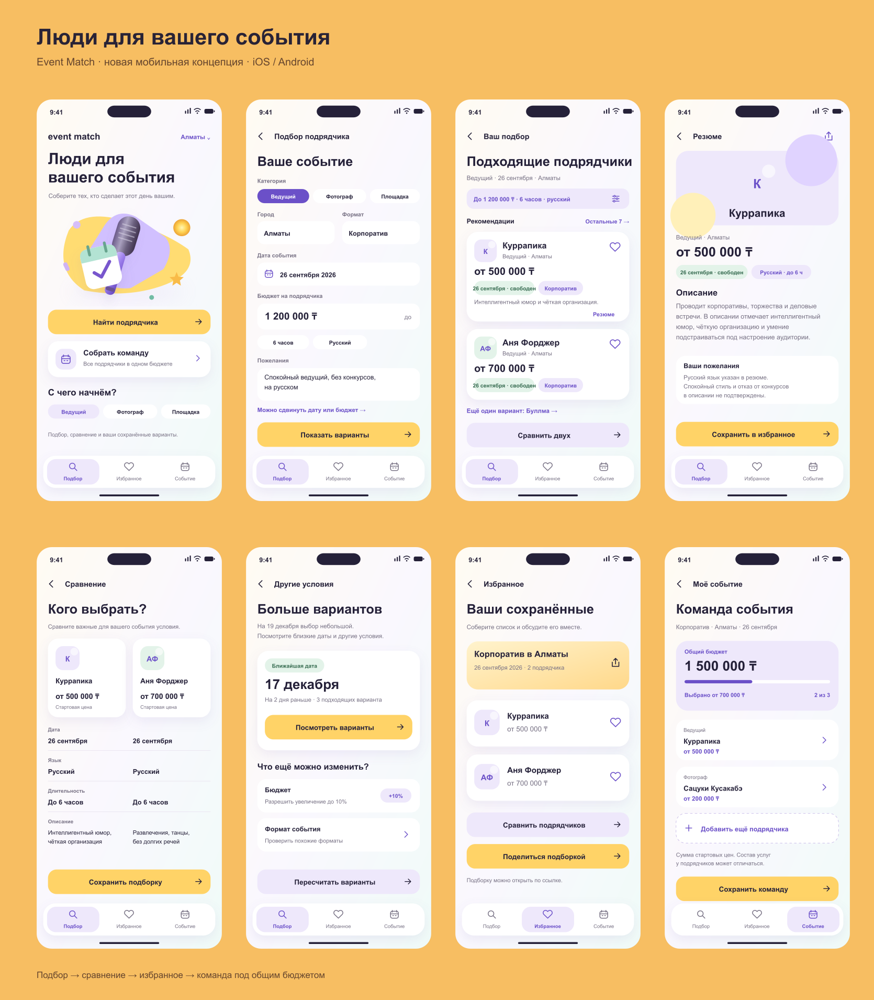

# Будущее мобильное приложение — макеты для Figma

Восемь экранов в вариантах для iOS и Android. Концепция развития приложения: сравнение, избранное, гибкие условия и команда под общим бюджетом.

## Просмотр
Откройте index.html. Нажимайте кнопки внутри макета или переключайте экраны в меню. Это прототип переходов: ввод и расчёты не подключены к приложению.

## Импорт в Figma
Перетащите SVG-файлы из папки ios или android на холст Figma. Каждый файл — отдельный векторный экран. SVG сохраняет текст и фигуры; это не нативные Figma-компоненты и не Auto Layout. Для точного отображения текста нужен шрифт Arial. Прототипные переходы из HTML при импорте SVG не переносятся.

## Размеры
iOS: 393 × 852. Android: 412 × 892, с отдельной системной панелью, без Dynamic Island и с менее округлыми элементами. Внутренняя композиция общая. Проверку поведения клавиатуры, системных диалогов и масштабирования текста следует выполнить при разработке.

## Визуальная система
Текст #252139; вторичный текст #777184; акцент #6B50C8; жёлтый #FFD367; сиреневый #EEE8FB; мятный #E3F3E9. Основные кнопки высотой 52, боковые поля 24. Шрифт Arial; основной текст 14, подписи 12, заголовки 28–33.

## Данные и состояния
Названия и стартовые цены взяты из текущего демонстрационного каталога. Это не предложение бронирования. Команда и общий бюджет — концепция новой функции; подбор нескольких категорий на совместную дату в этом прототипе не рассчитывается. Альтернативная дата показана отдельным примером для 19 декабря. Кнопка «Поделиться» показывает уведомление, реальную публичную ссылку не создаёт.

## Figma
Начатый файл: https://www.figma.com/design/IH1W1l2IkIaqBqHuZUnhxY
Создание нативных экранов прервано лимитом Figma MCP на Starter-плане. Этот файл не содержит готового дизайна. Полный результат находится в SVG и HTML в этом комплекте.
